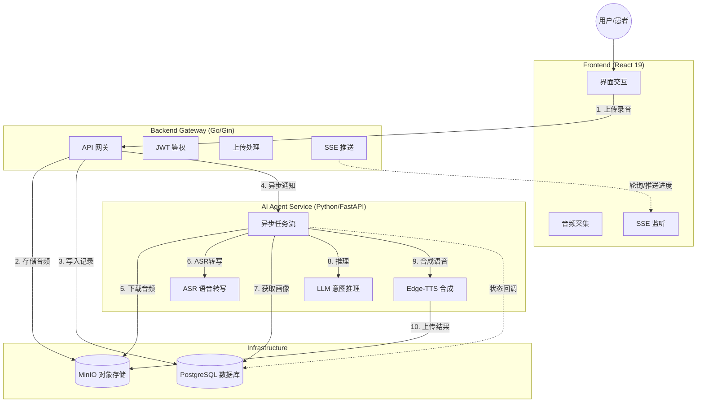

# VoiceBridge AI

> **所想即所说 (Speak What You Think)**
>
> 专为构音障碍（Dysarthria）患者打造的端云协同 AI 辅助沟通 Agent。

## 📖 项目简介 (Introduction)

**VoiceBridge AI** 旨在解决构音障碍患者（如脑卒中老人、脑瘫患者）因发音肌肉失调导致口齿不清，无法被传统语音识别工具理解的痛点。

本项目构建了一个智能体（Agent），利用 **OpenAI Whisper** 进行本地转录，结合 **大语言模型 (LLM)** 的语义推理能力，并参考用户的**个人画像 (Persona)** 与**环境语境**，将破碎、模糊的语音“修复”为清晰的意图，最终通过 **Edge-TTS** 合成清晰的语音代替用户表达。

## ✨ 核心功能 (Features)

  * **🎙️ 极简语音采集**: 专为老年人设计的大按钮界面，一键录音，支持长达 90 秒的语音输入。
  * **🧠 个性化意图推理**: 结合患者画像（如健康状况、常用物品、生活习惯），智能推断模糊语音背后的真实意图。
  * **⚖️ 三支决策机制 (Three-way Decision)**:
      * **Accept (\>85%)**: 意图清晰，直接合成语音播放。
      * **Boundary (50%-85%)**: 意图存疑，弹出大字体卡片询问用户确认。
      * **Reject (\<50%)**: 无法识别或噪音，友好提示重试。
  * **🔊 清晰语音播报**: 集成 TTS（Edge-TTS），支持清晰响亮的语音输出。
  * **👤 用户画像配置**: 允许家属/护工配置患者的健康数据和习惯，提升 AI 推理准确率。
  * **🌊 实时状态反馈**: 基于 SSE的实时进度流，让用户感知 AI 的“思考”过程。

## 🏗️ 系统架构 (Architecture)

项目采用**微服务架构**，主要包含以下组件：



## 🛠️ 技术栈 (Tech Stack)

### 1\. 前端交互层 (`/frontend`)

  * **框架**: React 19 + TypeScript
  * **构建**: Vite
  * **路由**: React Router v7
  * **UI**: Tailwind CSS + Lucide React (无障碍大字体设计)
  * **通信**: Axios (HTTP) + EventSource (SSE)

### 2\. 业务网关层 (`/backend`)

  * **语言**: Go 1.25+
  * **框架**: Gin Web Framework
  * **数据库**: GORM (PostgreSQL)
  * **存储**: MinIO SDK
  * **鉴权**: JWT (Golang-jwt)
  * **配置**: 12-Factor App (Godotenv)

### 3\. 智能体服务层 (`/ai_agent`)

  * **语言**: Python 3.10+
  * **框架**: FastAPI + Uvicorn
  * **ASR**: OpenAI Whisper (Local)
  * **LLM**: 兼容 OpenAI 格式 API (如 SiliconFlow, DeepSeek, Qwen)
  * **TTS**: Edge-TTS
  * **调度**: Asyncio BackgroundTasks

### 4\. 数据处理流水线 (`/data_pipeline`)

  * **功能**: 离线处理 TalkBank `.cha` 文件，视频转码 (`ffmpeg`)，音频清洗与数据集生成。

### 5\. 部署与运维

  * **容器化**: Docker & Docker Compose
  * **网关**: Nginx (反向代理 / SSL / SSE配置)

## 🚀 快速开始 (Quick Start)

### 前置要求

  * Docker & Docker Compose
  * (可选) Node.js & pnpm (用于本地开发前端)
  * (可选) Go 1.25+ (用于本地开发后端)
  * (可选) Python 3.10+ & FFmpeg (用于本地开发 AI Agent)

### 1\. 克隆项目

```bash
git clone https://github.com/your-username/voicebridge-ai.git
cd voicebridge-ai
```

### 2\. 环境配置

复制环境变量示例文件并填入你的配置（特别是 LLM API Key）：

```bash
cp .env.example .env
```

编辑 `.env` 文件：

```ini
# 必须配置
LLM_API_KEY=sk-xxxxxxxxxxxxxxxx  # 你的大模型 API Key
JWT_SECRET=your_random_secret    # 用于生成 Token 的密钥

# 其他默认即可 (Docker 环境下)
DB_HOST=db
MINIO_ENDPOINT=minio:9000
```

### 3\. 使用 Docker Compose 启动 (推荐)

一键启动所有服务（Postgres, MinIO, Backend, AI Agent）：

```bash
docker-compose up --build -d
```

启动后，访问：

  * **前端页面**: `http://localhost` (通过 Nginx 代理)
  * **MinIO 控制台**: `http://localhost:9001` (User/Pass: minioadmin/your\_minio\_password)
  * **Swagger 文档 (AI Agent)**: `http://localhost:8000/docs`

### 4\. 本地开发模式

#### 后端 (Go)

```bash
cd backend
go mod download
go run cmd/api_server/main.go
```

#### 前端 (React)

```bash
cd frontend
pnpm install
pnpm dev
```

#### AI Agent (Python)

需先安装 FFmpeg。

```bash
cd ai_agent
python -m venv venv
source venv/bin/activate  # Windows: venv\Scripts\activate
pip install -r requirements.txt
python main.py
```

## 📂 目录结构

```Plaintext

voicebridge-ai/
├── ai_agent/                 # Python AI 智能体服务
│   ├── api/                  # API 路由定义 (FastAPI Router)
│   ├── core/                 # 核心组件 (ASR, LLM, TTS, DB, Config)
│   ├── data/                 # 演示与运行时数据
│   ├── schemas/              # Pydantic 数据模型
│   ├── services/             # 业务流水线逻辑 (Pipeline)
│   ├── main.py               # 服务启动入口
│   ├── generate_configs.py   # 辅助脚本：生成配置
│   ├── run_dataset_demo.py   # 辅助脚本：运行演示数据集
│   └── requirements.txt      # Python 依赖
├── backend/                  # Go 业务网关
│   ├── cmd/
│   │   └── api_server/       # Go 程序入口 (main.go)
│   ├── internal/             # 私有业务代码
│   │   ├── app/              # 核心业务模块 (Handler, Service, Repo, Model)
│   │   ├── pkg/              # 内部基础组件 (Config, Database, Middleware, Storage)
│   │   └── router/           # Gin 路由注册
│   ├── pkg/                  # 公共工具包 (Constant, Errcode, Logger, Response, Utils)
│   ├── go.mod & go.sum       # Go 模块定义
│   └── Dockerfile            # 后端 Docker 构建文件
├── frontend/                 # React 前端应用
│   ├── src/
│   │   ├── api/              # API 请求封装 (Auth, Voice)
│   │   ├── assets/           # 静态资源 (Images)
│   │   ├── components/       # UI 组件 (Features, Layout, UI Elements)
│   │   ├── hooks/            # 自定义 Hooks (useVoiceProgress)
│   │   ├── lib/              # 通用库 (Request, Utils)
│   │   ├── pages/            # 页面视图 (Home, Profile, Login)
│   │   ├── routes/           # 路由配置
│   │   └── types/            # TypeScript 类型定义
│   ├── index.html            # 应用入口 HTML
│   └── vite.config.ts        # Vite 构建配置
├── data_pipeline/            # 离线数据处理流水线
│   ├── assets/               # 原始素材 (Video, Cha 文件)
│   ├── loaders/              # 数据加载器
│   ├── parsers/              # 格式解析器 (.cha)
│   ├── processors/           # 媒体处理 (Audio Cleaner, Converter)
│   ├── output/               # 处理结果输出目录
│   └── main_pipeline.py      # 流水线主程序
├── nginx/                   # 部署配置
│   └── default.conf               # Nginx 配置 (反向代理, SSE 支持)
├── docker-compose.yml        # 容器编排文件
└── .env.example              # 环境变量配置模板
```
## 🧪 数据集处理 (Data Pipeline)

本项目包含一个完整的数据处理流水线，用于处理 TalkBank 等来源的构音障碍研究数据。

1.  将 `.mp4` 视频放入 `data_pipeline/assets/video/`
2.  (可选) 将 `.cha` 转写文件放入 `data_pipeline/assets/cha/`
3.  运行流水线：
    ```bash
    cd data_pipeline
    python main_pipeline.py
    ```
4.  生成的标准 JSON 数据集将自动同步至 `ai_agent/data/demo/`。

## 🤝 贡献指南

欢迎提交 Issue 和 Pull Request！
特别是针对以下方面的改进：

  * 更多的方言支持 (ASR/LLM Prompt 优化)。
  * 针对不同病症（帕金森、脑瘫）的特定用户画像模板。
  * 前端无障碍体验的进一步优化。

## 📄 许可证

MIT License.