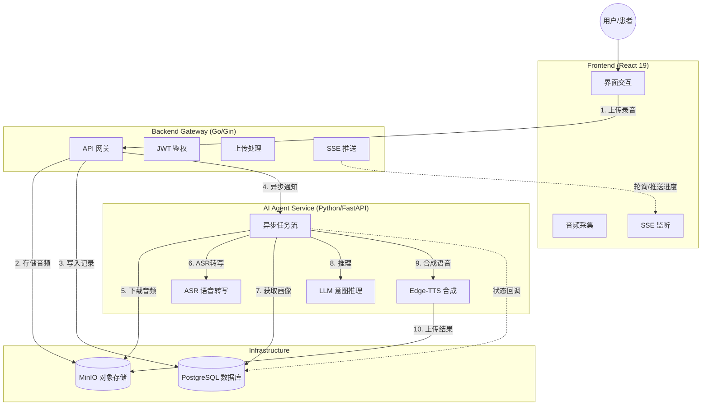

# VoiceBridge AI

> **所想即所说 (Speak What You Think)**
>
> 专为构音障碍（Dysarthria）患者打造的端云协同 AI 辅助沟通 Agent。

## 📑 目录导航

- [📖 项目简介](#-项目简介-introduction)
- [✨ 核心功能](#-核心功能-features)
- [🏗️ 系统架构](#️-系统架构-architecture)
- [🛠️ 技术栈](#️-技术栈-tech-stack)
- [🚀 快速开始](#-快速开始-quick-start)
  - [前置要求](#前置要求)
  - [环境配置](#1-环境配置)
  - [Docker 启动](#2-使用-docker-compose-启动-推荐)
  - [本地开发](#3-本地开发模式)
- [📂 目录结构](#-目录结构)
- [📖 详细使用指南](#-详细使用指南)
  - [用户端操作指南](#用户端操作指南)
    - [注册与登录](#1-注册与登录)
    - [配置个人画像](#2-配置个人画像)
    - [使用语音助手](#3-使用语音助手)
  - [管理员/开发者指南](#管理员开发者指南)
    - [服务管理](#1-服务管理)
    - [数据库管理](#2-数据库管理)
    - [MinIO 存储管理](#3-minio-存储管理)
    - [前端开发](#4-前端开发)
    - [后端开发](#5-后端开发)
    - [AI Agent 开发](#6-ai-agent-开发)
    - [测试脚本使用](#7-测试脚本使用)
    - [工具脚本使用](#8-工具脚本使用)
    - [环境变量配置](#9-环境变量配置说明)
    - [常见问题排查](#10-常见问题排查)
- [🧪 数据集处理](#-数据集处理-data-pipeline)
- [🤝 贡献指南](#-贡献指南)
- [📄 许可证](#-许可证)

## 📖 项目简介 (Introduction)

**VoiceBridge AI** 旨在解决构音障碍患者（如脑卒中老人、脑瘫患者）因发音肌肉失调导致口齿不清，无法被传统语音识别工具理解的痛点。

本项目构建了一个智能体（Agent），利用 **OpenAI Whisper** 进行本地转录，结合 **大语言模型 (LLM)** 的语义推理能力，并参考用户的**个人画像 (Persona)** 与**环境语境**，将破碎、模糊的语音“修复”为清晰的意图，最终通过 **Edge-TTS** 合成清晰的语音代替用户表达。

## ✨ 核心功能 (Features)

- **🎙️ 极简语音采集**: 专为老年人设计的大按钮界面，一键录音，支持长达 90 秒的语音输入。
- **🧠 个性化意图推理**: 结合患者画像（如健康状况、常用物品、生活习惯），智能推断模糊语音背后的真实意图。
- **⚖️ 三支决策机制 (Three-way Decision)**:
  - **Accept (\>85%)**: 意图清晰，直接合成语音播放。
  - **Boundary (50%-85%)**: 意图存疑，弹出大字体卡片询问用户确认。
  - **Reject (\<50%)**: 无法识别或噪音，友好提示重试。
- **🔊 清晰语音播报**: 集成 TTS（Edge-TTS），支持清晰响亮的语音输出。
- **👤 用户画像配置**: 允许家属/护工配置患者的健康数据和习惯，提升 AI 推理准确率。
- **🌊 实时状态反馈**: 基于 SSE 的实时进度流，让用户感知 AI 的“思考”过程。

## 🏗️ 系统架构 (Architecture)

项目采用**微服务架构**，主要包含以下组件：



## 🛠️ 技术栈 (Tech Stack)

### 1\. 前端交互层 (`/frontend`)

- **框架**: React 19 + TypeScript
- **构建**: Vite
- **路由**: React Router v7
- **UI**: Tailwind CSS + Lucide React (无障碍大字体设计)
- **通信**: Axios (HTTP) + EventSource (SSE)

### 2\. 业务网关层 (`/backend`)

- **语言**: Go 1.25+
- **框架**: Gin Web Framework
- **数据库**: GORM (PostgreSQL)
- **存储**: MinIO SDK
- **鉴权**: JWT (Golang-jwt)
- **配置**: 12-Factor App (Godotenv)

### 3\. 智能体服务层 (`/ai_agent`)

- **语言**: Python 3.10+
- **框架**: FastAPI + Uvicorn
- **ASR**: OpenAI Whisper (Local)
- **LLM**: 兼容 OpenAI 格式 API (如 SiliconFlow, DeepSeek, Qwen)
- **TTS**: Edge-TTS
- **调度**: Asyncio BackgroundTasks

### 4\. 数据处理流水线 (`/data_pipeline`)

- **功能**: 离线处理 TalkBank `.cha` 文件，视频转码 (`ffmpeg`)，音频清洗与数据集生成。

### 5\. 部署与运维

- **容器化**: Docker & Docker Compose
- **网关**: Nginx (反向代理 / SSL / SSE 配置)

## 🚀 快速开始 (Quick Start)

### 前置要求

- Docker & Docker Compose
- (可选) Node.js & pnpm (用于本地开发前端)
- (可选) Go 1.25+ (用于本地开发后端)
- (可选) Python 3.10+ & FFmpeg (用于本地开发 AI Agent)

### 1\. 克隆项目

```bash
git clone https://github.com/your-username/voicebridge-ai.git
cd voicebridge-ai
```

### 2\. 环境配置

复制环境变量示例文件并填入你的配置（特别是 LLM API Key）：

```bash
cp .env.example .env
```

编辑 `.env` 文件：

```ini
# 必须配置
LLM_API_KEY=sk-xxxxxxxxxxxxxxxx  # 你的大模型 API Key
JWT_SECRET=your_random_secret    # 用于生成 Token 的密钥

# 其他默认即可 (Docker 环境下)
DB_HOST=db
MINIO_ENDPOINT=minio:9000
```

### 3\. 使用 Docker Compose 启动 (推荐)

一键启动所有服务（Postgres, MinIO, Backend, AI Agent）：

```bash
docker-compose up --build -d
```

启动后，访问：

- **前端页面**: `http://localhost` (通过 Nginx 代理)
- **MinIO 控制台**: `http://localhost:9001` (User/Pass: minioadmin/your_minio_password)
- **Swagger 文档 (AI Agent)**: `http://localhost:8000/docs`

### 4\. 本地开发模式

#### 后端 (Go)

```bash
cd backend
go mod download
go run cmd/api_server/main.go
```

#### 前端 (React)

```bash
cd frontend
pnpm install
pnpm dev
```

#### AI Agent (Python)

需先安装 FFmpeg。

```bash
cd ai_agent
python3 -m venv venv
source venv/bin/activate  # Windows: venv\Scripts\activate
pip install -r requirements.txt
python3 main.py
```

## 📂 目录结构

```
voicebridge-ai/
├── ai_agent/                 # Python AI 智能体服务
│   ├── api/                  # FastAPI 路由定义
│   │   └── router.py         # Agent API 端点 (/process, /callback)
│   ├── core/                 # 核心组件模块
│   │   ├── asr_whisper.py    # Whisper 语音识别
│   │   ├── llm_reasoning.py  # LLM 意图推理 (支持重试)
│   │   ├── tts_edge.py       # Edge-TTS 语音合成
│   │   ├── database.py       # SQLAlchemy 数据模型
│   │   ├── storage.py        # MinIO 对象存储客户端
│   │   └── config.py         # 配置管理
│   ├── services/             # 业务流水线
│   │   └── pipeline.py       # 异步任务编排 (ASR → LLM → TTS)
│   ├── schemas/              # Pydantic 数据模型
│   │   └── task.py           # 任务请求/响应结构
│   ├── data/                 # 演示与运行时数据
│   │   ├── demo/             # 演示用户数据 (JSON 格式)
│   │   └── grand_round_dataset.json  # 测试数据集
│   ├── main.py               # FastAPI 服务启动入口
│   ├── generate_configs.py  # 辅助脚本: 生成用户配置
│   ├── run_dataset_demo.py  # 辅助脚本: 批量测试数据集
│   ├── requirements.txt      # Python 依赖清单
│   └── Dockerfile            # AI Agent 容器构建文件
│
├── backend/                  # Go 业务网关服务
│   ├── cmd/
│   │   └── api_server/       # 程序入口
│   │       └── main.go       # HTTP 服务器启动
│   ├── internal/             # 内部业务代码
│   │   ├── app/
│   │   │   ├── handler/      # 请求处理器 (User, Voice)
│   │   │   ├── service/      # 业务逻辑层
│   │   │   ├── repository/   # 数据访问层 (GORM)
│   │   │   └── model/        # 数据模型 (User, VoiceRecord, AnalysisResult)
│   │   ├── pkg/              # 内部公共组件
│   │   │   ├── config/       # 配置加载 (Viper/Godotenv)
│   │   │   ├── database/     # PostgreSQL 连接池
│   │   │   ├── middleware/   # JWT 鉴权中间件
│   │   │   └── storage/      # MinIO 存储封装
│   │   └── router/           # Gin 路由注册
│   │       └── router.go     # 路由表定义
│   ├── pkg/                  # 外部可用工具包
│   │   ├── constant/         # 常量定义
│   │   ├── errcode/          # 错误码与消息
│   │   ├── logger/           # Zap 日志封装
│   │   ├── response/         # 统一 JSON 响应格式
│   │   └── utils/            # JWT/UUID 工具
│   ├── go.mod & go.sum       # Go 模块依赖
│   └── Dockerfile            # 后端容器构建文件
│
├── frontend/                 # React 前端应用
│   ├── src/
│   │   ├── api/              # API 请求封装
│   │   │   ├── auth.ts       # 登录/注册/登出
│   │   │   ├── voice.ts      # 语音上传/历史/取消
│   │   │   └── index.ts      # API 统一导出
│   │   ├── components/       # React 组件
│   │   │   ├── features/     # 功能组件
│   │   │   │   ├── AudioRecorder.tsx   # 语音录制器
│   │   │   │   └── StatusCard.tsx      # 状态卡片 (进度/结果)
│   │   │   ├── layout/       # 布局组件
│   │   │   │   └── MainLayout.tsx      # 主布局 (导航栏)
│   │   │   └── ui/           # 通用 UI 组件 (Button, Card, Input)
│   │   ├── hooks/            # 自定义 React Hooks
│   │   │   └── useVoiceProgress.ts    # SSE 实时进度监听
│   │   ├── pages/            # 页面视图
│   │   │   ├── Home/         # 语音助手主页
│   │   │   ├── Profile/      # 个人信息管理
│   │   │   ├── History/      # 历史记录查看
│   │   │   └── Auth/         # 登录/注册页
│   │   ├── routes/           # React Router 配置
│   │   │   └── index.tsx     # 路由表
│   │   ├── store/            # 状态管理 (预留)
│   │   ├── types/            # TypeScript 类型定义
│   │   │   └── index.ts      # 全局类型 (User, VoiceRecord, AnalysisResult)
│   │   └── lib/              # 工具库
│   │       ├── request.ts    # Axios 请求封装
│   │       └── utils.ts      # 通用工具函数
│   ├── public/               # 静态资源
│   ├── index.html            # HTML 入口文件
│   ├── vite.config.ts        # Vite 构建配置
│   ├── tailwind.config.js    # Tailwind CSS 配置
│   ├── package.json          # npm 依赖
│   └── Dockerfile            # 前端容器构建文件
│
├── data_pipeline/            # 数据处理流水线
│   ├── assets/               # 原始数据素材
│   │   ├── video/            # 待处理的 MP4 视频
│   │   └── cha/              # TalkBank .cha 转写文件
│   ├── loaders/              # 数据加载器
│   │   ├── base.py           # 基类 Loader
│   │   └── demo_loader.py    # 演示数据加载器
│   ├── parsers/              # 文件解析器
│   │   └── cha_parser.py     # .cha 格式解析
│   ├── processors/           # 媒体处理器
│   │   ├── converter.py      # 视频转音频 (FFmpeg)
│   │   └── audio_cleaner.py  # 音频降噪/标准化
│   ├── output/               # 处理结果输出目录
│   ├── main_pipeline.py      # 流水线主程序
│   └── requirements.txt      # Python 依赖
│
├── deploy/                   # 部署配置文件
│   │
│   └── prometheus/           # 监控配置 (预留)
│
├── tests/                    # 测试文件目录
│   └── scripts/              # 测试脚本
│       ├── test_asr_llm.py           # ASR + LLM 集成测试
│       ├── test_tts.py               # TTS 功能测试
│       ├── test_full_pipeline.py     # 完整流程测试
│       ├── test_upload_quick.py      # 快速上传测试
│       └── test_frontend_integration.py  # 前端集成测试
│
├── scripts/                  # 工具脚本目录
│   ├── check_proxy.sh        # 检查代理配置
│   ├── check_tts_status.sh   # 检查 TTS 服务状态
│   ├── deploy_cosy.sh        # 部署 CosyVoice (已弃用)
│   ├── quick_deploy.sh       # 快速部署脚本
│   └── rebuild_tts.sh        # 重建 TTS 容器
│
├── docs/                     # 项目文档
│   ├── DEPLOYMENT_STATUS.md  # 部署状态记录
│   └── TTS_REFACTOR_REPORT.md # TTS 重构报告
│
├── docker-compose.yml        # Docker Compose 编排文件
├── .env                      # 环境变量配置 (本地, 不提交)
├── .env.example              # 环境变量模板
├── .gitignore                # Git 忽略文件
└── README.md                 # 项目说明文档 (本文件)
```

## 📖 详细使用指南

### 用户端操作指南

#### 1. 注册与登录

1. 访问 `http://localhost/login`
2. 首次使用点击"注册"按钮
3. 填写用户名和密码(密码至少 6 位)
4. 注册成功后自动跳转到登录页
5. 输入凭证登录系统

#### 2. 配置个人画像

**为什么需要配置画像？**
个人画像帮助 AI 更准确地理解患者的表达意图。例如，"拿那个...那个药"，AI 会根据患者的常用药物列表推断具体是哪种药。

**配置步骤：**

1. 点击顶部导航栏的"个人信息"按钮
2. 填写以下信息：
   - **姓名**: 患者真实姓名
   - **年龄**: 实际年龄
   - **健康状况**: 如"脑卒中后遗症"、"脑瘫"、"帕金森病"
   - **生活习惯**: 如"喜欢看电视"、"每天下午散步"
   - **常用物品/需求**: 如"轮椅、拐杖、血压计、降压药、水杯"
3. 点击"保存"按钮

#### 3. 使用语音助手

**录音流程：**

1. 返回首页(点击"语音助手"按钮)
2. 点击中央的大麦克风按钮开始录音
3. 对着设备清晰说话(支持最长 90 秒)
4. 再次点击麦克风或等待自动停止
5. 等待 AI 处理(会显示实时进度)

**处理过程：**

- **语音识别(10-30%)**: AI 正在将您的声音转为文字
- **意图理解(30-70%)**: AI 正在分析您想表达的意思
- **语音合成(70-100%)**: AI 正在生成清晰的语音

**结果展示：**

- **Accept(接受)**: AI 理解了您的意图,显示"您的指令"和清晰的表达文本,自动播放语音
- **Boundary(确认)**: AI 不太确定,显示"AI 确认"和询问文本,如"您想表达的意思是否为：去喝水？"
- **Reject(拒绝)**: AI 无法理解,显示"AI 反馈"和提示"抱歉,我不理解您说的话。您可以换一种方式再说一遍吗？"


### 管理员/开发者指南

#### 1. 服务管理

**查看所有服务状态：**

```bash
docker compose ps
```

**查看服务日志：**

```bash
# 查看所有服务日志
docker compose logs -f

# 查看特定服务
docker compose logs -f ai_agent    # AI Agent 日志
docker compose logs -f backend     # 后端日志
docker compose logs -f frontend    # 前端日志
docker compose logs -f postgres    # 数据库日志
```

**重启服务：**

```bash
# 重启单个服务
docker compose restart ai_agent

# 重启所有服务
docker compose restart

# 停止并删除所有容器
docker compose down

# 重新构建并启动
docker compose up --build -d
```

#### 2. 数据库管理

**连接数据库：**

```bash
docker exec -it voicebridge_postgres psql -U nainong -d nainong
```

**常用查询：**

```sql
-- 查看所有用户
SELECT id, username, name, age FROM users;

-- 查看语音记录
SELECT id, status, decision, created_at FROM voice_records ORDER BY id DESC LIMIT 10;

-- 查看分析结果
SELECT id, decision, confidence,
       LEFT(asr_text, 50) as asr,
       LEFT(response_text, 50) as response
FROM analysis_results
ORDER BY id DESC LIMIT 10;

-- 查看特定用户的记录
SELECT vr.id, vr.status, ar.decision, ar.confidence
FROM voice_records vr
LEFT JOIN analysis_results ar ON vr.id = ar.voice_record_id
WHERE vr.user_id = 1
ORDER BY vr.id DESC;
```

#### 3. MinIO 存储管理

**访问 MinIO 控制台：**

1. 打开 `http://localhost:9001`
2. 用户名: `minioadmin`
3. 密码: 查看 `.env` 文件中的 `MINIO_ROOT_PASSWORD`

**查看存储文件：**

- Bucket 名称: `voicebridge`
- 语音文件路径: `voices/YYYY/MM/DD/uuid-timestamp.webm`
- TTS 文件路径: `tts/{record_id}_tts_{hash}.wav`

#### 4. 前端开发

**修改前端代码后重新构建：**

```bash
docker compose build frontend && docker compose up -d frontend
```

**本地开发模式(热更新)：**

```bash
cd frontend
pnpm install
pnpm dev
# 访问 http://localhost:5173
```

#### 5. 后端开发

**修改后端代码后重新构建：**

```bash
docker compose build backend && docker compose up -d backend
```

**本地开发模式：**

```bash
cd backend
go run cmd/api_server/main.go
# 服务运行在 http://localhost:8080
```

#### 6. AI Agent 开发

**修改 AI Agent 后重启：**

```bash
docker compose restart ai_agent
```

**查看 AI Agent 详细日志：**

```bash
docker compose logs -f ai_agent | grep -E "Pipeline|ASR|LLM|TTS|Error"
```

**本地开发模式：**

```bash
cd ai_agent
python3 -m venv venv
source venv/bin/activate
pip install -r requirements.txt
python3 main.py
# 服务运行在 http://localhost:8000
# 访问 Swagger 文档: http://localhost:8000/docs
```

#### 7. 测试脚本使用

**快速测试上传功能：**

```bash
python3 tests/scripts/test_upload_quick.py
```

**测试 ASR + LLM 流程：**

```bash
python3 tests/scripts/test_asr_llm.py
```

**测试完整流程：**

```bash
python3 tests/scripts/test_full_pipeline.py
```

**测试 TTS 合成：**

```bash
python3 tests/scripts/test_tts.py
```

**运行所有集成测试：**

```bash
# 如果需要批量运行多个测试
for test in tests/scripts/test_*.py; do
  echo "Running $test..."
  python3 "$test" || echo "Test failed: $test"
done
```

#### 8. 工具脚本使用

**检查代理配置：**

```bash
bash scripts/check_proxy.sh
```

**检查 TTS 服务状态：**

```bash
bash scripts/check_tts_status.sh
```

**快速部署(一键重启所有服务)：**

```bash
bash scripts/quick_deploy.sh
```

#### 9. 环境变量配置说明

编辑 `.env` 文件配置以下关键参数：

```ini
# === LLM 配置 ===
LLM_API_KEY=sk-xxxx              # 必填: 大模型 API Key
LLM_BASE_URL=https://api.xxx.com # LLM API 基础 URL
LLM_MODEL=deepseek-chat          # 使用的模型名称

# === 数据库配置 ===
DB_HOST=postgres                 # Docker 环境用 postgres, 本地用 localhost
DB_PORT=5432
DB_USER=nainong
DB_PASSWORD=nainong123
DB_NAME=nainong

# === MinIO 配置 ===
MINIO_ENDPOINT=minio:9000        # Docker 环境用 minio:9000
MINIO_ACCESS_KEY=xxxxxx
MINIO_SECRET_KEY=xxxxxx
MINIO_BUCKET=voicebridge
MINIO_USE_SSL=false

# === 认证配置 ===
JWT_SECRET=your_random_secret_key_here  # 必填: 修改为随机字符串

# === 服务端口 ===
BACKEND_PORT=8080
AI_AGENT_PORT=8000
FRONTEND_PORT=80
```

#### 10. 常见问题排查

**问题: AI Agent 报错 "LLM API Key not configured"**

- 解决: 检查 `.env` 文件中 `LLM_API_KEY` 是否正确配置
- 重启服务: `docker compose restart ai_agent`

**问题: 前端无法连接后端**

- 检查所有容器是否运行: `docker compose ps`
- 检查后端日志: `docker compose logs backend`
- 确认端口映射正确: 后端应在 8080, 前端在 80

**问题: 语音识别结果不准确**

- 确保录音环境安静
- 尽量靠近麦克风说话
- 配置完整的个人画像信息

**问题: 数据库连接失败**

- 检查 PostgreSQL 容器状态: `docker compose ps postgres`
- 查看数据库日志: `docker compose logs postgres`
- 确认 `.env` 中数据库配置正确

**问题: MinIO 无法访问文件**

- 检查 MinIO 容器状态: `docker compose ps minio`
- 访问 MinIO 控制台检查 bucket 权限
- 确认 bucket 设置为 public download

## 🧪 数据集处理 (Data Pipeline)

本项目包含一个完整的数据处理流水线，用于处理 TalkBank 等来源的构音障碍研究数据。

### 处理流程

1.  将 `.mp4` 视频放入 `data_pipeline/assets/video/`
2.  (可选) 将 `.cha` 转写文件放入 `data_pipeline/assets/cha/`
3.  运行流水线：
    ```bash
    cd data_pipeline
    python3 main_pipeline.py
    ```
4.  生成的标准 JSON 数据集将自动同步至 `ai_agent/data/demo/`

### 生成的数据格式

```json
{
  "user_id": "ROSE",
  "persona": {
    "name": "Rose",
    "age": 68,
    "condition": "脑卒中后遗症，构音障碍",
    "habits": "喜欢看电视，每天下午散步",
    "common_needs": "轮椅、拐杖、血压计、降压药"
  },
  "samples": [
    {
      "audio_path": "path/to/audio.wav",
      "transcript": "我...我想...喝水",
      "ground_truth": "我想喝水"
    }
  ]
}
```

## 🤝 贡献指南

欢迎提交 Issue 和 Pull Request。我是笨蛋，求指教。
特别是针对以下方面的改进：

- 更多的方言支持 (ASR/LLM Prompt 优化)。
- 针对不同病症（帕金森、脑瘫）的特定用户画像模板。
- 前端无障碍体验的进一步优化。

## 📄 许可证

MIT License.
